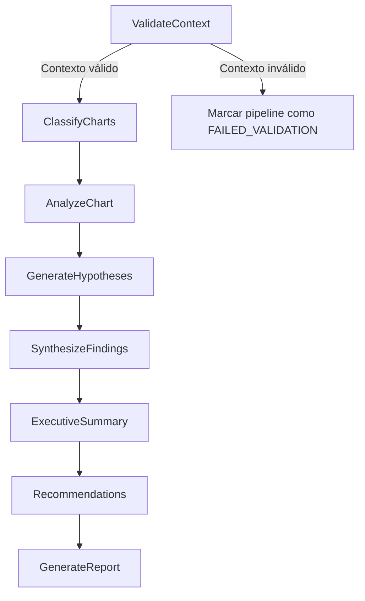

## AAQ – Agente de Análisis Cuantitativo

AAQ es un **Sistema de Producción de Conocimiento** diseñado para transformar estudios cuantitativos (gráficas + contexto metodológico) en **informes ejecutivos profesionales** de análisis estratégico.

**AAQ NO es un chatbot** ni un asistente conversacional.  
Es un **sistema experto** que genera **outputs cognitivos estructurados**, trazables y explicables.

---

## Objetivo principal

**Transformar investigación cuantitativa en conocimiento ejecutivo accionable**, a través de:

- **Calidad epistemológica** del análisis.
- **Estructura del conocimiento** (outputs bien definidos y reutilizables).
- **Explicabilidad y trazabilidad** del flujo cognitivo.

---

## Visión general de la arquitectura

- **Backend**
  - FastAPI (API HTTP)
  - LangGraph (orquestación del pipeline cognitivo)
  - LangChain + GPT (motor LLM)
  - PostgreSQL (persistencia relacional)
  - Redis (cache)
  - File system (almacenamiento de gráficas e informes)
  - Celery/RQ (jobs asíncronos)

- **Frontend**
  - React / Next.js
  - Autenticación con JWT
  - Carga de contexto y gráficas
  - Visualización del estado del pipeline y resultados

- **Despliegue**
  - Contenedores Docker
  - Soporte para despliegue **on‑premise**

---

## Pipeline cognitivo (LangGraph)

El flujo cognitivo es **obligatorio** y se implementa como un grafo en LangGraph, donde cada nodo tiene una responsabilidad única:

1. `ValidateContext`  
2. `ClassifyCharts`  
3. `AnalyzeChart`  
4. `GenerateHypotheses`  
5. `SynthesizeFindings`  
6. `ExecutiveSummary`  
7. `Recommendations`  
8. `GenerateReport`

Cada paso:

- Recibe un estado de entrada bien tipado (Pydantic).
- Produce un estado de salida persistido en BD.
- Registra prompts, respuestas y metadatos para trazabilidad.

---

## Modelo conceptual (resumen)

- **ResearchContext**
  - `profile`
  - `background`
  - `business_question`
  - `study_type`
  - `segments`
  - `sample`
  - `significance_threshold`
  - `models`
  - `measurements`
  - `qualitative_study`

- **ChartAnalysis**
  - `explanation`
  - `hypotheses`
  - `business_impact`

- **ExecutiveReport**
  - `executive_summary`
  - `chart_insights`
  - `key_findings`
  - `implications`
  - `recommendations`
  - `strategies`

---

## Requerimientos funcionales clave

- **RF‑01**: Cargar contexto del estudio.  
- **RF‑02**: Cargar gráficas (PNG/JPG/PDF/PPTX).  
- **RF‑03**: Validar información mínima del estudio.  
- **RF‑04**: Analizar cada gráfica.  
- **RF‑05**: Generar resumen ejecutivo.  
- **RF‑06**: Generar recomendaciones estratégicas.  
- **RF‑07**: Exportar informe (PDF/DOCX).  
- **RF‑08**: Consultar estudios previos.

---

## Diagramas de arquitectura

### Diagrama de alto nivel (sistema completo)

Diagrama en texto (visión rápida):

- Usuario (analista / ejecutivo)  
  → Frontend (Next.js/React)  
  → Backend (FastAPI)  
  → Capa de aplicación (casos de uso)  
  → Capa de dominio (servicios cognitivos + modelos)  
  → Pipeline LangGraph (nodos ValidateContext → … → GenerateReport)  
  → Infraestructura:
    - PostgreSQL (persistencia)
    - Redis (cache)
    - File system (gráficas, informes)
    - Worker Celery/RQ (ejecución asíncrona)
    - LLM (LangChain + GPT)

Diagrama equivalente en Mermaid (renderizable en muchos editores/visores Markdown):

```mermaid
flowchart LR
  User[Usuario] --> UI[UI Web]
  UI --> API[API HTTP]
  API --> UC[Casos de Uso]
  UC --> SD[Servicios de Dominio]
  SD --> MD[Modelo de Dominio]

  subgraph "Pipeline Cognitivo (LangGraph)"
    VC[ValidateContext]
    CC[ClassifyCharts]
    AC[AnalyzeChart]
    GH[GenerateHypotheses]
    SF[SynthesizeFindings]
    ES[ExecutiveSummary]
    RE[Recommendations]
    GR[GenerateReport]
  end

  SD --> VC
  SD --> CC
  SD --> AC
  SD --> GH
  SD --> SF
  SD --> ES
  SD --> RE
  SD --> GR

  subgraph "Infraestructura"
    PG[(PostgreSQL)]
    RD[(Redis)]
    FS[(File System)]
    WK[Worker Celery/RQ]
    LLM[LLM (LangChain + GPT)]
  end

  UC --> PG
  UC --> RD
  UC --> FS
  UC --> WK
  SD --> LLM
```

---

### Diagrama del pipeline cognitivo (LangGraph)

Representación textual:

- `ValidateContext`  
  → valida `ResearchContext`  
  → si falta información, se detiene el pipeline.
- `ClassifyCharts`  
  → clasifica cada gráfica y enriquece metadatos.
- `AnalyzeChart`  
  → produce `ChartAnalysis` por gráfica.
- `GenerateHypotheses`  
  → consolida hipótesis a nivel de estudio.
- `SynthesizeFindings`  
  → agrupa hipótesis en hallazgos clave.
- `ExecutiveSummary`  
  → sintetiza la historia ejecutiva principal.
- `Recommendations`  
  → traduce hallazgos en implicaciones, recomendaciones y estrategias.
- `GenerateReport`  
  → ensambla `ExecutiveReport` y genera PDF/DOCX.

Diagrama de flujo en Mermaid:



---

## Principios de diseño

Este proyecto sigue estrictamente:

- **DDD (Domain‑Driven Design)**:
  - Entidades, Value Objects, servicios de dominio y repositorios bien definidos.
  - El dominio **no depende** de frameworks ni infraestructura.
- **SOLID & GRASP**:
  - Cada servicio tiene **una sola responsabilidad**.
  - Dependencias invertidas mediante interfaces (repositorios, proveedores de LLM, etc.).
- **Arquitectura en capas**:
  - `domain` → modelo de negocio y lógica cognitiva.
  - `application` → casos de uso y orquestación.
  - `infrastructure` → persistencia, LLM, colas, almacenamiento.
  - `interfaces` → APIs (FastAPI), DTOs, autenticación.
- **Trazabilidad total**:
  - Cada ejecución del pipeline se registra con:
    - `study_id`, `pipeline_run_id`, `step_name`.
    - snapshots de entrada/salida.
    - prompts y respuestas del LLM.
- **Persistencia de todos los outputs**:
  - Ningún resultado significativo se pierde en memoria.

---

## Estructura de carpetas (propuesta inicial backend)

La implementación de referencia se organizará en algo similar a:

```plaintext
app/
  main.py
  config/
  core/
  domain/
    models/
    services/
    repositories/
  application/
    use_cases/
    dto/
  infrastructure/
    db/
    repositories/
    files/
    llm/
    caching/
    workers/
    graphs/
  interfaces/
    api/
    schemas/
```

Esta estructura puede refinarse conforme se implementen los primeros casos de uso.

---

## Puesta en marcha (muy preliminar)

> Nota: esta sección se completará cuando se definan los primeros módulos de código.

Pasos esperados:

1. Clonar repositorio.
2. Crear entorno virtual y activar.
3. Instalar dependencias (`requirements.txt` o `pyproject.toml` cuando estén disponibles).
4. Configurar variables de entorno básicas:
   - conexión a PostgreSQL
   - conexión a Redis
   - credenciales de GPT / proveedor LLM
   - rutas de almacenamiento de archivos
5. Ejecutar migraciones y levantar la API FastAPI.
6. (Opcional) Levantar workers de Celery/RQ y servicios auxiliares (Redis, PostgreSQL) con Docker.

---

## Estado actual

Este README describe la **visión inicial de arquitectura y dominio** de AAQ.  
Las siguientes fases del proyecto se centrarán en:

- Definir modelos de dominio en Pydantic.
- Implementar el pipeline en LangGraph.
- Conectar los servicios de dominio con el LLM y la base de datos.
- Diseñar la API pública (FastAPI) y el frontend (React/Next.js).

